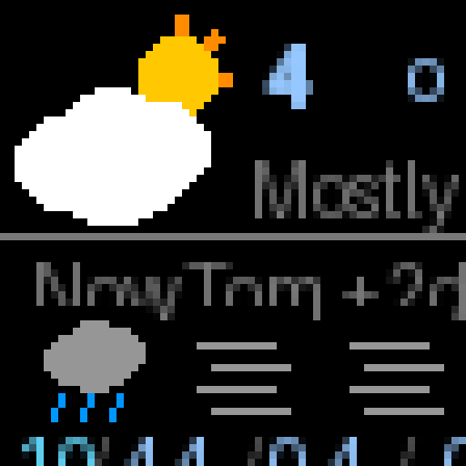

# Weather Display for 64x64 RGB LED Matrix

Display current weather conditions and a 3-day forecast on a 64x64 RGB LED matrix panel.



## Features

- Current weather with large pictogram and temperature
- 3-day forecast with icons and high/low temps
- Customizable location (defaults to Uster, Switzerland)
- Auto-refresh every 15 minutes
- Preview mode for testing without hardware

## Hardware

- [RGB Matrix P3.0 64x64](https://seengreat.com/wiki/74/rgb-matrix-p3-0-64x64) (HUB75 interface)
- Raspberry Pi (tested on Pi 1 Model B)

## Installation

### 1. Install rpi-rgb-led-matrix

```bash
git clone https://github.com/hzeller/rpi-rgb-led-matrix.git
cd rpi-rgb-led-matrix
make build-python PYTHON=$(which python3)
sudo make install-python PYTHON=$(which python3)
```

### 2. Install Python dependencies

```bash
cd weather
python3 -m venv venv
source venv/bin/activate
pip install -r requirements.txt
```

## Usage

```bash
# Default location (Uster, Switzerland)
sudo venv/bin/python main.py

# Specify location by name
sudo venv/bin/python main.py --location "Zurich"

# Specify coordinates
sudo venv/bin/python main.py --lat 47.37 --lon 8.54

# Adjust brightness (0-100)
sudo venv/bin/python main.py --brightness 30

# Change refresh interval (minutes)
sudo venv/bin/python main.py --refresh 30
```

### Testing without hardware

```bash
# Generate preview image
./venv/bin/python main.py --preview

# Run in simulation mode
./venv/bin/python main.py --simulate
```

## Weather Icons

| Icon | Conditions |
|------|------------|
| ☀️ | Clear sky |
| ⛅ | Partly cloudy |
| ☁️ | Overcast |
| 🌧️ | Rain, drizzle, showers |
| ❄️ | Snow |
| ⛈️ | Thunderstorm |
| 🌫️ | Fog |

## API

Weather data from [Open-Meteo](https://open-meteo.com/) (free, no API key required).

## License

MIT
